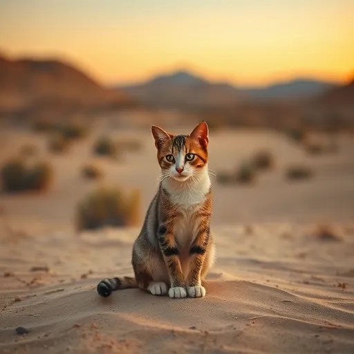

I followed Black Forest Labs' official implementation on [here](https://github.com/black-forest-labs/flux/tree/main/src/flux)
You can find complete visualization of Flux [here](https://lucid.app/lucidchart/4f4fd2a9-d730-4468-884b-671700e32cbf/view) and [here](https://lucid.app/lucidchart/e8f1cd34-7825-42f4-ba5f-1d4dfc224a63/view)

# Flux Image Generations

Default Generation Settings:
```python
width: int = 512
height: int = 512
num_steps: int = 4
guidance: float = 3.5
seed: int = 1
```

## Model Details
- Default model: Flux-Schnell
- Alternative option: Change to Flux-dev by modifying:
```python
flux_model_name = "flux-dev"
```

## Generated Images

### 1. Desert Cat


**Prompt:**
"Cat in the middle of desert."

---

### 2. Venom-Spiderman


**Prompt:**
"Venom cuddles spiderman"
