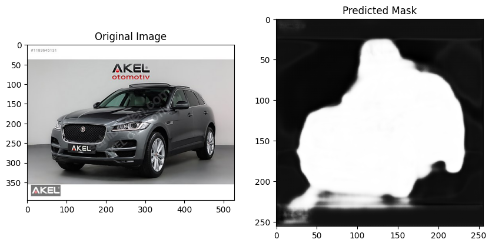
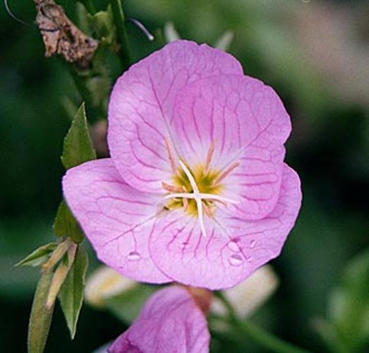
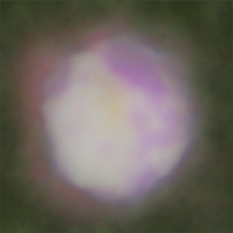
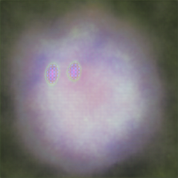

I implemented UNet from scratch using PyTorch for 2 tasks that I was into:
- Image Segmentation:
    - I trained the model for only 25 epochs with 1e-4 learning rate
    - 
- Image Generation:
    - Trained 2 models
    - **First Model**
        - Has 37.792.707 trainable parameters
        - Trained for 13 epochs with 1e-4 learning rate
    - **Second Model**
        - Has 131.135.427 trainable parameters
        - Trained for 10 epochs with 1e-4 learning rate

**NOTE:** I didn't train these models for an extended period because I wanted to focus more on the implementation rather than spending a lot of time on the training process. I stopped the training when I thought the models would be able to generate an image.

## Comparison

  

    <h3>Target Image</h3>
    
  

  

    <h3>Model 1 Generated</h3>
    
  

  

    <h3>Model 2 Generated</h3>
    
  

